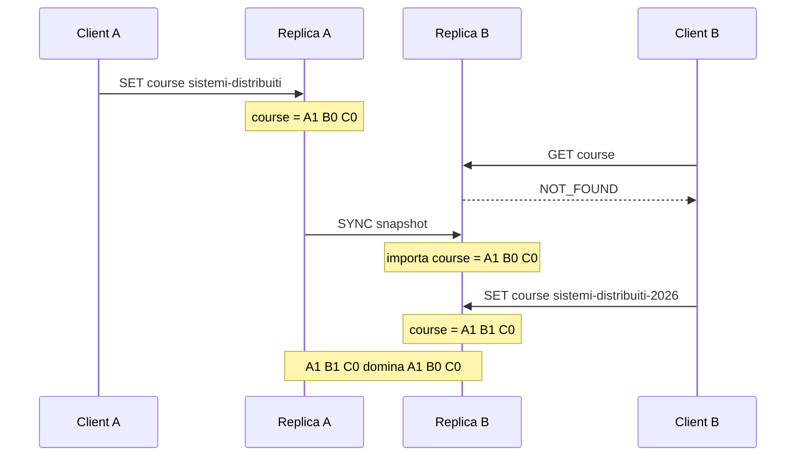
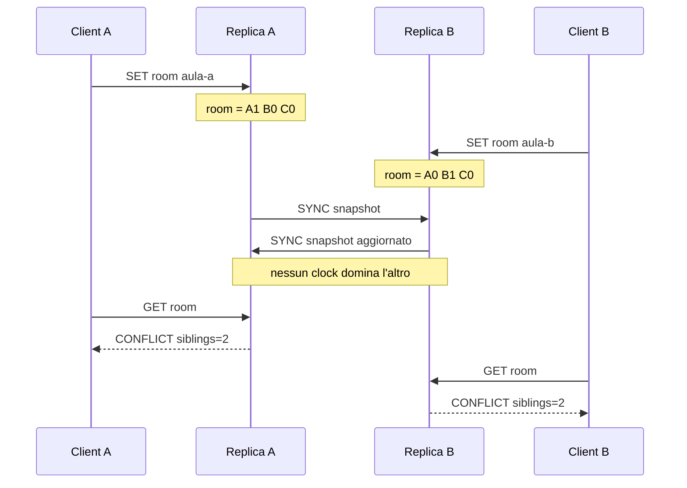
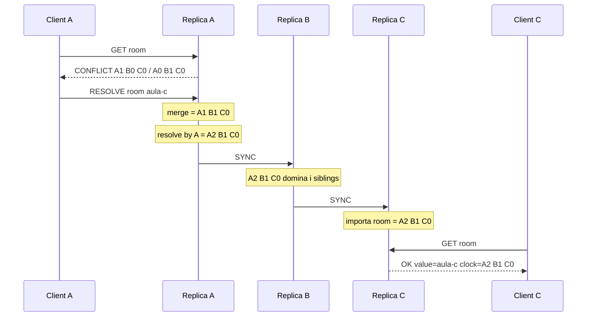
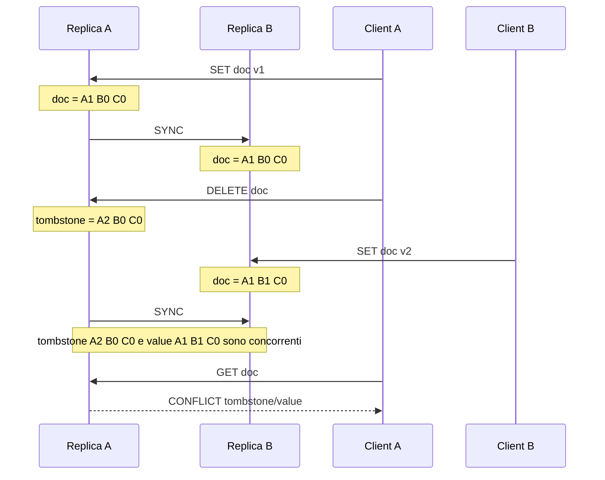

# Handout: Vector Clock Integrati in un KV Store Distribuito

## Perché questa lezione

Nelle lezioni precedenti abbiamo usato il KV store per introdurre:

- interfacce testuali e contratto di protocollo;
- concorrenza locale e sezioni critiche;
- persistenza;
- replica;
- failover;
- quorum;
- sharding;
- versioning e CAS;
- sincronizzazione e clock logici.

Questa lezione unisce due fili del corso:

```text
KV store distribuito + causalità tra aggiornamenti
```

Il problema non è soltanto salvare un valore. Il problema è capire cosa
significa salvare un valore quando più repliche possono accettare aggiornamenti
in modo indipendente.

## Problema

Supponiamo di avere tre repliche:

```text
A, B, C
```

La replica `A` riceve:

```text
SET room aula-a
```

La replica `B`, senza avere ancora visto l'aggiornamento di `A`, riceve:

```text
SET room aula-b
```

Entrambe le scritture sono localmente valide. Quando `A` e `B` si
sincronizzano, il sistema deve decidere se:

- una versione sostituisce l'altra;
- le versioni sono concorrenti;
- il conflitto può essere risolto automaticamente;
- il conflitto deve essere mostrato all'applicazione.

Una versione intera come `version=7` non basta, perché non dice chi conosce
quali aggiornamenti.

## Version vector per chiave

Nel laboratorio ogni versione di ogni chiave ha un vector clock:

```text
value = aula-a
clock = A:1,B:0,C:0
```

Il clock non rappresenta l'ora fisica. Rappresenta conoscenza causale sugli
aggiornamenti della chiave:

```text
A:1 = questa versione include un aggiornamento prodotto da A
B:0 = questa versione non include aggiornamenti prodotti da B
C:0 = questa versione non include aggiornamenti prodotti da C
```

In questo laboratorio il clock è un **version vector per chiave**. Non conta
tutti gli eventi locali del processo; conta gli aggiornamenti applicativi
rilevanti per quella chiave.

## Dominio causale

Dati due clock `x` e `y`:

```text
x <= y se ogni componente di x è <= della componente corrispondente di y
x < y  se x <= y e almeno una componente è strettamente minore
```

Se:

```text
x < y
```

allora `y` domina `x`. La versione con clock `y` può sostituire quella con
clock `x`, perché include causalmente almeno la stessa conoscenza e qualcosa in
più.

Esempio:

```text
old = A:1,B:0,C:0
new = A:1,B:1,C:0
```

`new` domina `old`: contiene l'aggiornamento di `A` e anche un aggiornamento di
`B`.

## Concorrenza

Due clock sono concorrenti quando nessuno domina l'altro.

Esempio:

```text
v1 = A:1,B:0,C:0
v2 = A:0,B:1,C:0
```

`v1` conosce un aggiornamento di `A`, ma non quello di `B`.

`v2` conosce un aggiornamento di `B`, ma non quello di `A`.

Il sistema non ha evidenza causale per dire che una versione è successiva
all'altra.

## Siblings

Quando due versioni della stessa chiave sono concorrenti, il KV store mantiene
entrambe:

```text
room:
  [0] value=aula-a clock=A:1,B:0,C:0
  [1] value=aula-b clock=A:0,B:1,C:0
```

Queste versioni concorrenti sono chiamate **siblings**.

La proprietà di safety è:

```text
non scartare una versione concorrente come se fosse vecchia
```

Scartarla significherebbe perdere un aggiornamento senza che il sistema abbia
una prova causale che quell'aggiornamento sia stato superato.

## Contratto dell'interfaccia

Il laboratorio espone comandi volutamente semplici:

| Comando | Contratto |
| --- | --- |
| `GET key` | restituisce il valore se c'è una sola versione viva; restituisce conflitto se ci sono siblings |
| `SET key value` | crea una nuova versione solo se non esiste un conflitto locale |
| `SYNC port` | sincronizza due repliche e compatta solo versioni dominate |
| `RESOLVE key value` | crea una versione che domina i siblings locali |
| `DELETE key` | crea una tombstone versionata |
| `DUMP` | mostra lo stato locale completo |

Il punto più importante è:

```text
SET non è una risoluzione implicita dei conflitti.
```

Se `GET room` mostra due siblings, un successivo `SET room aula-c` viene
rifiutato. Serve `RESOLVE room aula-c`, perché la scelta del valore vincente è
una decisione applicativa.

## Modalità di funzionamento

Ogni nodo mantiene:

```text
data: key -> list[Version]
```

Ogni `Version` contiene:

```text
value
clock
origin
deleted
```

Quando arriva `SET key value`:

1. il nodo legge le versioni locali della chiave;
2. se trova più siblings, rifiuta l'operazione;
3. fonde i clock delle versioni locali;
4. incrementa la propria componente;
5. salva la nuova versione;
6. compatta le versioni dominate.

Quando arriva `SYNC peer`:

1. il nodo chiede uno snapshot al peer;
2. fonde lo snapshot remoto nello stato locale;
3. invia il proprio snapshot aggiornato al peer;
4. il peer fonde a sua volta;
5. entrambi eliminano solo versioni causalmente dominate.

Questa forma di sincronizzazione è una anti-entropy bidirezionale semplificata.

## Diagrammi temporali

Nei diagrammi seguenti il tempo scorre dall'alto verso il basso.

I diagrammi non rappresentano il tempo fisico assoluto. Rappresentano la
sequenza osservabile di eventi e messaggi che produce una certa relazione
causale.

### Caso 1: scrittura causale e propagazione

In questo scenario `B` aggiorna la chiave solo dopo avere ricevuto la versione
prodotta da `A`. La seconda versione domina la prima.



Lettura del diagramma:

- `A` produce la prima versione;
- `B` non la vede prima della sincronizzazione;
- dopo `SYNC`, `B` conosce l'aggiornamento di `A`;
- quando `B` scrive, il clock risultante include la conoscenza precedente;
- la nuova versione può sostituire quella vecchia.

### Caso 2: scritture concorrenti e siblings

In questo scenario `A` e `B` scrivono la stessa chiave senza avere visto
l'aggiornamento dell'altra replica.



Lettura del diagramma:

- `A1 B0 C0` contiene solo l'aggiornamento di `A`;
- `A0 B1 C0` contiene solo l'aggiornamento di `B`;
- le due versioni sono concorrenti;
- la sincronizzazione non può scegliere un vincitore sicuro;
- il sistema conserva entrambe le versioni come siblings.

### Caso 3: risoluzione esplicita e convergenza

Qui il conflitto è già visibile su `A` e `B`. Una replica risolve il conflitto
producendo una nuova versione che domina entrambi i siblings.



Lettura del diagramma:

- `RESOLVE` non è un semplice `SET`;
- la risoluzione incorpora la conoscenza di tutti i siblings osservati;
- la componente di `A` aumenta perché `A` produce un nuovo aggiornamento;
- dopo sincronizzazioni sufficienti, le repliche convergono.

### Caso 4: cancellazione concorrente con scrittura

Una cancellazione distribuita deve essere trattata come un aggiornamento
versionato. Se una cancellazione è concorrente con una scrittura, non può
vincere automaticamente.



Lettura del diagramma:

- `DELETE` crea una tombstone con clock causale;
- `SET doc v2` su `B` parte da una conoscenza diversa;
- la cancellazione non domina la scrittura concorrente;
- la scrittura non domina la cancellazione concorrente;
- anche questo conflitto richiede una policy applicativa.

## Risoluzione dei conflitti

Quando una chiave ha siblings, il sistema non può dedurre semanticamente il
valore giusto. Può solo dire:

```text
queste versioni sono concorrenti
```

La risoluzione esplicita:

```text
RESOLVE room aula-c
```

crea un nuovo clock partendo dal massimo componente per componente dei siblings,
poi incrementa la componente della replica che risolve.

Esempio:

```text
s1 = A:1,B:0,C:0
s2 = A:0,B:1,C:0
merge = A:1,B:1,C:0
resolve by A = A:2,B:1,C:0
```

Il nuovo clock domina entrambi i siblings.

## Safety

Safety del laboratorio:

```text
una versione concorrente non viene eliminata durante la sincronizzazione
```

Questa proprietà è implementata dalla funzione di compattazione:

```text
elimina candidate solo se esiste other tale che candidate.clock < other.clock
```

Se i clock sono concorrenti, entrambe le versioni restano.

## Liveness

La liveness richiede ipotesi operative:

- le repliche continuano a essere raggiungibili;
- `SYNC` viene eseguito prima o poi tra repliche che devono convergere;
- i conflitti vengono risolti dall'applicazione o dall'operatore;
- la membership resta coerente durante la demo.

Sotto queste ipotesi, la convergenza è plausibile:

```text
se tutti vedono la stessa versione risolta,
e quella versione domina i siblings,
allora le repliche finiranno con una sola versione viva
```

## Cosa il laboratorio non risolve

Il laboratorio è intenzionalmente didattico. Non implementa:

- persistenza su disco;
- autenticazione;
- cifratura;
- membership dinamica;
- consenso;
- quorum di lettura/scrittura;
- garbage collection avanzata delle tombstone;
- policy applicative automatiche di merge.

Queste omissioni sono utili: isolano il ruolo dei vector clock senza confondere
la dimostrazione con altri meccanismi distribuiti.

## Collegamento con architetture reali

Questo schema è vicino a sistemi che preferiscono disponibilità locale e
convergenza successiva. In un sistema reale, la risoluzione dei conflitti può
essere:

- manuale;
- applicativa;
- automatica per tipi di dato specifici;
- basata su CRDT;
- delegata a regole di dominio.

La lezione chiave è che l'interfaccia deve dichiarare quale scelta viene fatta.
Un sistema che nasconde i conflitti dietro una policy implicita sta comunque
offrendo un contratto, solo più difficile da vedere e verificare.
